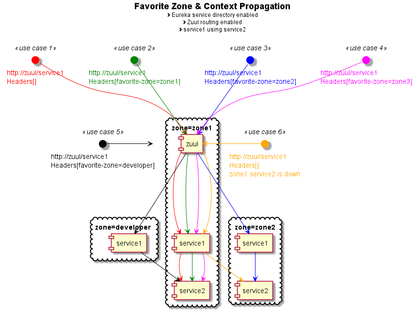

# [Spring Cloud Ribbon Extensions v1.4.4-SNAPSHOT](https://github.com/enadim/spring-cloud-ribbon-extensions/wiki) :rocket::microscope:

:exclamation:Must Have:exclamation: Enhance your micro-service testing, maintenance & overall development productivity.

**Spring Cloud Ribbon Extensions** is a set of load balancing rules that chooses which server to target.
It comes with handy features for easy integration, configuration and customization.

:warning: This is an experimental version designed for dev environments.

:dash: Official version coming soon.

:warning: stomp & jms integration tests has not been performed yet.


[](https://travis-ci.org/enadim/spring-cloud-ribbon-extensions)
[](https://codecov.io/gh/enadim/spring-cloud-ribbon-extensions)
[](https://www.codacy.com/app/enadim/spring-cloud-ribbon-extensions?utm_source=github.com&amp;utm_medium=referral&amp;utm_content=enadim/spring-cloud-ribbon-extensions&amp;utm_campaign=Badge_Grade)

[](https://sonarcloud.io/component_measures?id=enadim:spring-cloud-ribbon-extensions:develop&metric=reliability_rating)
[](https://sonarcloud.io/component_measures?id=enadim:spring-cloud-ribbon-extensions:develop&metric=security_rating)
[](https://sonarcloud.io/component_measures?id=enadim:spring-cloud-ribbon-extensions:develop&metric=sqale_rating)
[](https://sonarcloud.io/component_measures?id=enadim:spring-cloud-ribbon-extensions:develop&metric=Coverage)
[](https://sonarcloud.io/component_measures?id=enadim:spring-cloud-ribbon-extensions:develop&metric=Duplications)


[](https://oss.sonatype.org/#nexus-search;gav~com.github.enadim~spring-cloud-ribbon-extensions~1.4.4-SNAPSHOT)
[](http://www.javadoc.io/doc/com.github.enadim/spring-cloud-ribbon-extensions/1.4.4-SNAPSHOT)

[](https://github.com/enadim/spring-cloud-ribbon-extensions/develop/LICENSE)
[](https://github.com/enadim/spring-cloud-ribbon-extensions/issues)
[](https://github.com/enadim/spring-cloud-ribbon-extensions/network/members)

## Requirements
* spring cloud ribbon.
* spring cloud Daslton-SR3.

## Compatibility
* spring cloud eureka.
* spring cloud feign.
* spring cloud zuul.
* spring cloud hystrix.
* spring and java executors.
* spring stomp.
* jms.

## Features

### Routing Rules.

#### Zone Affinity
[@EnableRibbonZoneAffinity](https://github.com/enadim/spring-cloud-ribbon-extensions/wiki/Zone-Affinity): Enables routing to the same zone: see the tests for concrete usage and configurations.

Designed mainly for micro-services that should calls others in the same zone.

#### Favorite Zone :gem:
[@EnableRibbonFavoriteZone](https://github.com/enadim/spring-cloud-ribbon-extensions/wiki/Favorite-Zone): Enables routing to a favorite zone: see the tests for concrete usage and configurations.

Designed mainly for testing a micro-service among an existing micro-service architecture without disruption. This is the feature that triggered this project.

#### Strict Metadata Matcher
[@EnableRibbonStrictMetadataMatcher](https://github.com/enadim/spring-cloud-ribbon-extensions/wiki/Strict-Metadata-Matcher): Enables routing to servers that have a set of metadata: see the tests for concrete usage and configurations.

Designed to target a specific micro-service that holds a point to point connection with an external system (like FIX,...)

Requires Eureka.

#### Dynamic Metadata Matcher :gem:
[@EnableRibbonDynamicMetadataMatcher](https://github.com/enadim/spring-cloud-ribbon-extensions/wiki/Dynamic-Metadata-Matcher): Enables routing against a dynamic key: see the tests for concrete usage and configurations.

Designed to target a specific micro-services that holds multiple point to point connections with many external systems (like FIX,...)

Requires Eureka.

### Context Propagation :gem:
[@EnableContextPropagation](https://github.com/enadim/spring-cloud-ribbon-extensions/wiki/Context-Propagation): Enables sharing the execution context through all the micro-services: see the tests for concrete usage and configurations.

Designed to propagate the execution context across the micro-services architecture.

What does it support:
* Transport: http, jms, stomp.
* Async: java, spring, Hystrix.
* Zuul

:warning:You should use only lower case key names (http header limitation).

### [Combine Favorite Zone & Context Propagation](https://github.com/enadim/spring-cloud-ribbon-extensions/wiki/Context-Propagation-And-Favorite-Zone) :sparkles:
Eureka:exclamation: Let's enter a world of easy development and testing with micro-service architecture.
* Developers are able to deploy & debug their own micro-service and get back any request they have initiated disregarding the entry point and without being annoyed by the requests they have not initiated.
* Deploying in multi region-and let our clients (that have no knowledge of eureka, ribbon, zuul) choose the zone they prefer to target.
* And other things that I have not thought about...



## Setup

maven
```xml
<dependency>
  <groupId>com.github.enadim</groupId>
  <artifactId>spring-cloud-ribbon-extensions</artifactId>
  <version>1.4.4-SNAPSHOT</version>
</dependency>
```

gradle
```gradle
dependencies {
    compile 'com.github.enadim:spring-cloud-ribbon-extensions:1.4.4-SNAPSHOT'
}
```

## Contribution
Any help is welcome. :ok_hand:
